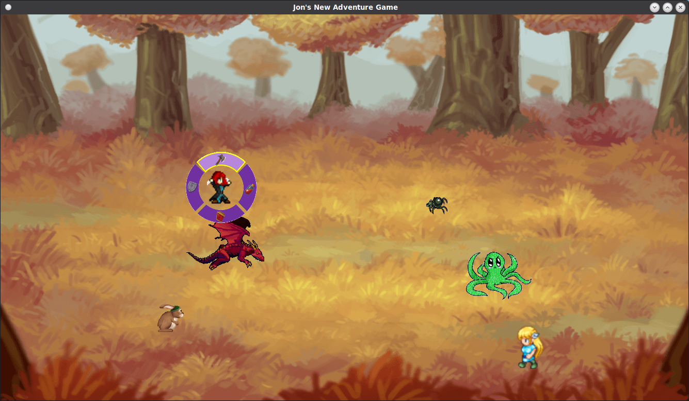

<h1>Untitled Adventure Game</h1>
<h3>Dependencies</h3>
<ul><li>C++ 11</li>
<li>SFML</li></ul>
<h3>Description</h3>

An incomplete project that helped me to learn about SFML libraries. It doesn't do much more than display
an animated battle screen that resembles a Final Fantasy style RPG. I plan on finishing this, but perhaps 
in the distant future. I still have quite a bit to learn before I can complete a project of this scale by myself.

<h3>Screen Shot</h3>

